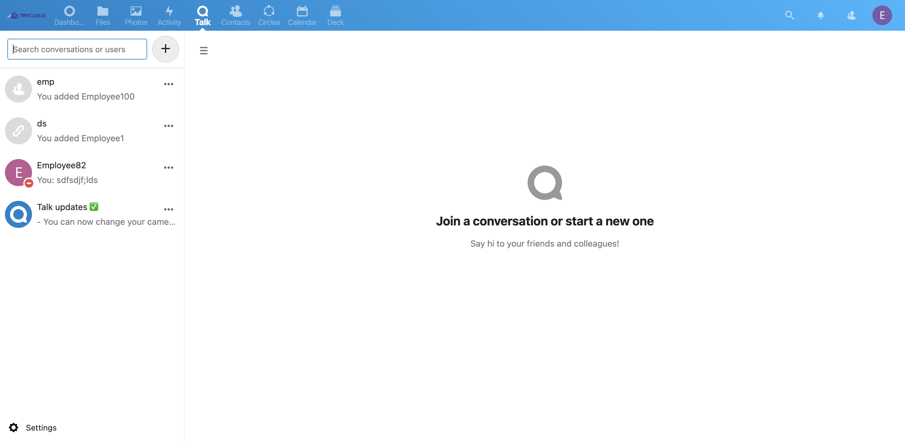
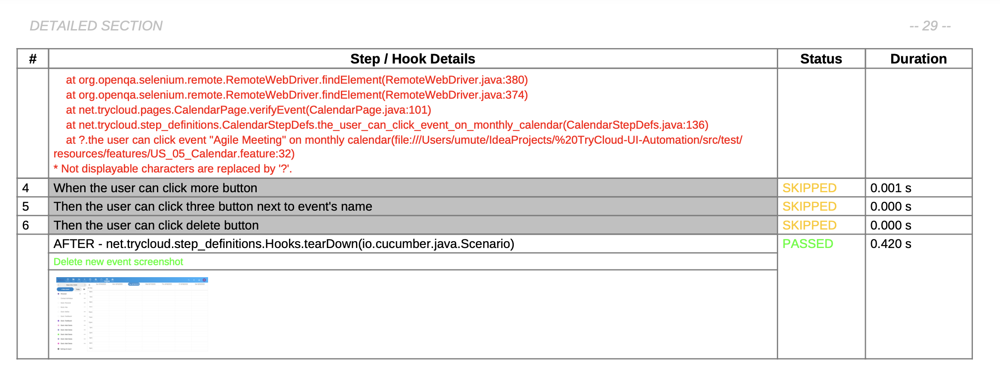
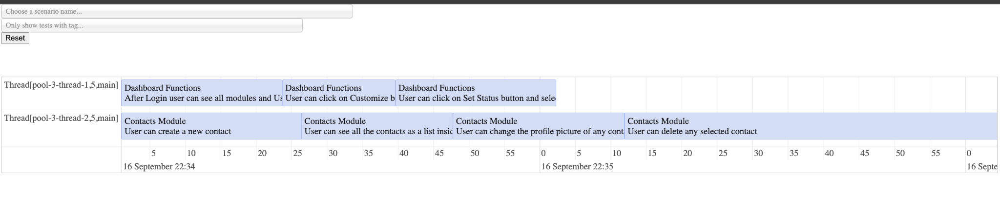

# TryCloud-UI-Automation (Selenium · Cucumber · JUnit · Maven · Jenkins)

- This project was built as part of my portfolio to demonstrate practical SDET skills, reporting, and CI/CD integration.

## This repo demonstrates:
- Cross‑browser validation (Chrome, Firefox, Edge, Safari, headless modes)
- Feature/class‑level parallel execution for faster feedback
- Deterministic, tag-driven suites for @smoke pipelines and @wip tests
- Portable reporting (Cucumber HTML, JSON, Timeline) suitable for sharing in CI
- A clean Page Object Model with driver lifecycle isolation and robust hooks
- CI/CD with Jenkins (parameterized, matrix‑ready jobs, HTML Publisher)

## Tech stack
- Java 11, Maven
- Selenium 4, Cucumber JVM 7, JUnit 4
- IntelliJ IDEA
- Jenkins (Freestyle/Matrix), HTML Publisher
- Reporting: Cucumber HTML/JSON + Timeline
- Design: Page Object Model, utilities for driver/config/hooks

## Repository structure (high‑level)
- `src/test/resources/features/` — Gherkin feature files (business‑readable specs)
- `src/test/java/net/trycloud/pages/` — Page Object Model (UI mapping, behaviors)
- `src/test/java/net/trycloud/step_defintions/` — Step definitions (glue)
- `src/test/java/net/trycloud/runners/` — Cucumber runners (`CukesRunner`, `FailedTestRunner`)
- `src/test/java/net/trycloud/utilities/` — `Driver`, `ConfigurationReader`, `BrowserUtils`
- `pom.xml` — Dependency and build lifecycle config (Surefire parallelism, reporting)

## Design choices
- Page Object Model keeps locators and UI actions close to the page they represent.
- `Driver` uses Selenium Manager (Selenium 4.6+) so no manual driver binaries required.
- `InheritableThreadLocal<WebDriver>` provides thread‑safe driver instances under parallel runs.
- `ConfigurationReader` centralizes environment and browser configuration.
- Hooks (`@Before`/`@After`) ensure driver/session isolation and clean teardown.

## Key capabilities
...
- Robust reporting:
  - Cucumber Pretty HTML...
  - Cucumber JSON...
  - Timeline...
  - **Extent Reports (HTML/PDF):** customizable rich reports configured via `extent.properties` and `extent-pdf-config.yaml`
    - HTML: `target/extent-reports/extent-report.html`
    - PDF: `target/extent-reports/extent-report.pdf`
- Reruns: failing scenarios collected into `target/rerun.txt` for selective retry

### Cross-Browser Testing
- The framework supports execution on Chrome, Firefox, Edge, and Safari.
- Browser selection is configurable via `config.properties` or Maven parameter `-Dbrowser`.
- Example:
  - `mvn clean test -Dbrowser=chrome`
  - `mvn clean test -Dbrowser=firefox`

### Parallel Testing
- Configured via Maven Surefire plugin.
- Tests can run concurrently at method or class level.
- Current setup: 2 threads (`<parallel>methods</parallel>`).
- Driver instances are thread-safe via `InheritableThreadLocal<WebDriver>`.

## Reporting & Demonstration Notes
- To demonstrate that the tests are functioning, several feature files have been executed with the `@wip` tag, and their **Extent** and **Cucumber Reports** are included in the repository. These reports illustrate how the framework records and presents results.
- Additionally, a small set of `@smoke` tests have been executed through **Jenkins**, and the corresponding **Cucumber Report** generated from Jenkins has been added. This provides a concrete example of CI-driven reporting.

  - In this project, one scenario is intentionally left as **failed** (triggered by a `NoSuchElementException`).
    - The purpose is to demonstrate how the framework generates reports when a test fails.
    - Both **Extent Reports** and **Cucumber Reports** capture and display the failed step clearly.
    - In addition, Cucumber Reports have been configured to automatically attach a **screenshot** of the application state at the exact step where the failure occurred.
    - This design choice is intentional for showcasing error handling and reporting capabilities; when all locators are up-to-date, the full suite passes successfully.

    ### Report PDFs
      - Cucumber Report of some feature files → [Cucumber_Report.pdf](test-reports/Cucumber_Report_Features.pdf)
      - Extent Report of some feature files → [Extent_Report.pdf](test-reports/Extent_Report_Features.pdf)
      - Cucumber Report of essential `@smoke` tests via Jenkins → [Jenkins_Cucumber_Report.pdf](test-reports/Jenkins_Smoke_Cucumber_Report.pdf)

    ## Screenshots (examples)
      - Failed step screenshot captured in **Cucumber Report**
      - Failed step screenshot captured in **Extent Report**
      - Parallel execution shown in **Timeline Report**
      
      
      

## Running locally
- Run tests with Maven:
    - `mvn clean test -Dbrowser=chrome -Dcucumber.filter.tags=@smoke`
- Reports generated:
    - HTML: `target/cucumber/cucumber-html-reports/overview-features.html`
    - Timeline: `target/timeline/index.html`
    - Extent Reports (HTML/PDF): `target/extent-reports/`

## Running with Maven (locally or CI)
- Smoke suite: `mvn clean test -Dtest=CukesRunner -Dbrowser=headless-chrome -Dcucumber.filter.tags=@smoke`
- Full suite: `mvn clean test -Dtest=CukesRunner`
- Parallel execution enabled via Surefire (feature/class level with JUnit).

## CI/CD (Jenkins)
- Integrated with Jenkins for automated builds and test execution.
- Supports parameterized jobs for browser selection (`BROWSER`) and tag filtering (`TAGS`).
- Generates and publishes Cucumber HTML, Timeline, and JUnit XML reports as Jenkins artifacts.
- Matrix jobs can be configured to run tests across multiple browsers in parallel.

## Test strategy & tagging
- Business-readable scenarios live under `features/` (focused, small, deterministic).
- Tag policy:
    - `@smoke` — login, navigation, and other top-critical journeys
    - `@wip` — work-in-progress scenarios; excluded by default in CI
- Flaky tests: unstable scenarios are isolated from `@smoke` until stabilized.

## Configuration and secrets
- `config.properties` contains non-sensitive defaults (e.g., `browser`, base URL).
- Credentials are **not** committed; they are passed via CI parameters/secrets instead.
- **For security reasons**, credentials in this portfolio project have been modified and do not represent real accounts.
- Portfolio note: when sharing public reports, sanitize screenshots and messages to avoid exposing private data.

## How to read the code
- Start from runner `net.trycloud.runners.CukesRunner`
- Open `net.trycloud.utilities.Driver` for driver lifecycle and browser selection
- Explore pages in `net.trycloud.pages.*`
- Tie behavior to steps in `net.trycloud.step_defintions.*`
- See `pom.xml` for parallelism/reporting configuration

---

This repo is designed to reflect real-world SDET practices: readable specifications, maintainable structure, fast feedback cycles, and shareable reporting.

